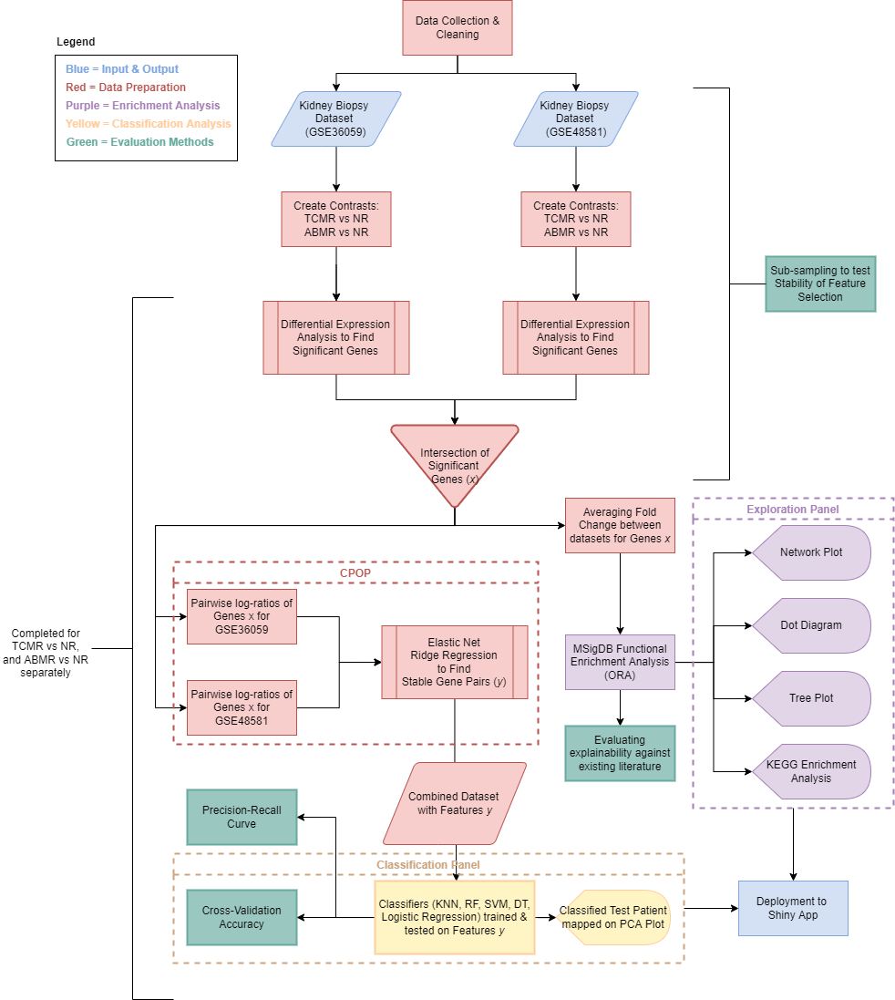
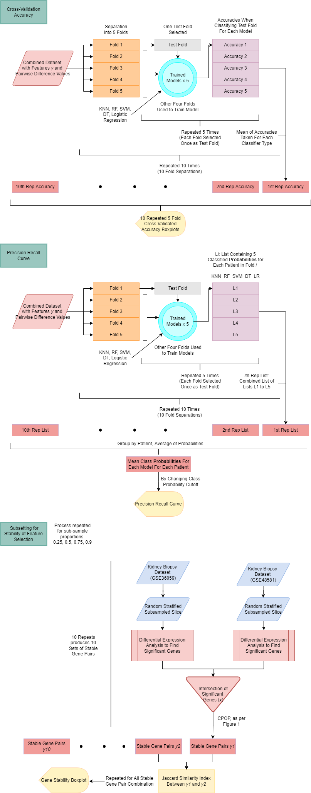

```{r setup, include=FALSE}
knitr::opts_chunk$set(echo = TRUE)
```


```{r echo=FALSE, message=FALSE, warning=FALSE}
library(dplyr)
library(tidyr)
library(devtools)
library(ggplot2)
library(stringr)
library(stringdist)
library(BiocManager)
library(GEOquery) 
library(R.utils)
library(Biobase)
library(reshape2)
library(limma)
library(stats)
library(blorr)
library(viridis)
library(plotly)
library(ggrepel)
library(CPOP)
library(clusterProfiler)
library(DOSE)
library(org.Hs.eg.db)
library(pathview)
library(gtools)
library(rpart)
library(yardstick)
library(enrichplot)
library(msigdbr)
```

# Code {.tabset}

## Data Collection

```{r, cache=TRUE, message=FALSE, warning=FALSE}
library(dplyr)
# Reading in Data
GEO_GSE36059 = getGEO("GSE36059")
GSE36059 = GEO_GSE36059$GSE36059_series_matrix.txt.gz

# Example of functions that return patient data, feature data, expression matrix
#head(pData(GSE36059)[,1:5])
#head(fData(GSE36059)[,1:5])
#head(exprs(GSE36059)[,1:5])

# How to return gene names
#rownames(eMat_GSE36059)
#length(rownames(eMat_GSE36059))

# Load relevant matrices
eMat_GSE36059 = exprs(GSE36059)
p_GSE36059 = dplyr::rename(pData(GSE36059), diagnosis = `diagnosis:ch1`)
p_GSE36059$diagnosis = gsub("non-rejecting", "NR", p_GSE36059$diagnosis)

# Rows & patient id with control diagnosis of nephrectomy
control_idx = which(p_GSE36059$diagnosis == "Nephrectomy" | p_GSE36059$diagnosis == "MIXED")
remove_patient_id = rownames(p_GSE36059)[control_idx]

# Remove controls from patient and expression dataset
p_GSE36059 = p_GSE36059[!(row.names(p_GSE36059) %in% remove_patient_id),]
eMat_GSE36059 = eMat_GSE36059[, !(colnames(eMat_GSE36059) %in% remove_patient_id)]

# Multiple probes test same genes
#sum(duplicated(fData(GSE36059)$`Gene Symbol`))

# List of the main genes
all_gene_symbols = unlist(lapply(strsplit(fData(GSE36059)$`Gene Symbol`, ' /// ', 1), `[`, 1))

# Get index of probe_ids to keep which are not duplicates or have NA values
#idx = which(!duplicated(fData(GSE36059)$`Gene Symbol`) & !is.na(fData(GSE36059)$`Gene Symbol`))
idx = which(!duplicated(all_gene_symbols) & !is.na(fData(GSE36059)$`Gene Symbol`) & !(fData(GSE36059)$`Gene Symbol` == ""))
# Remove duplicate gene probes & probes w/o gene names
eMat_GSE36059 = eMat_GSE36059[idx,]

# Print gene symbols
gene_symbols = fData(GSE36059) %>%
  dplyr::select(ID, `Gene Symbol`) 
kept_gene_symbols = gene_symbols[idx,] %>% dplyr::pull(`Gene Symbol`)

# Map Affymetrix gene probe to gene symbol
AFFX_gene_symbols = gene_symbols[idx,] %>% mutate(`Gene Symbol` = all_gene_symbols[idx] )

# Replace probe ids with gene names
rownames(eMat_GSE36059) = lapply(strsplit(kept_gene_symbols, ' /// ', 1), `[`, 1)

```

```{r, cache=TRUE, message=FALSE, warning=FALSE}
GEO_GSE48581 = getGEO("GSE48581")
GSE48581 = GEO_GSE48581$GSE48581_series_matrix.txt.gz

# Load relevant matrices
eMat_GSE48581 = exprs(GSE48581)
p_GSE48581 = dplyr::rename(pData(GSE48581), diagnosis = `diagnosis (tcmr, abmr, mixed, non-rejecting, nephrectomy):ch1` )

# Rename non-rejecting level
p_GSE48581$diagnosis = gsub("non-rejecting", "NR", p_GSE48581$diagnosis)


# Remove rows & patient id with control diagnosis of nephrectomy or mixed
control_idx = which(p_GSE48581$diagnosis == "nephrectomy" | p_GSE48581$diagnosis == "mixed")
remove_patient_id = rownames(p_GSE48581)[control_idx]

# Remove from patient and expression dataset
p_GSE48581 = p_GSE48581[!(row.names(p_GSE48581) %in% remove_patient_id),]
eMat_GSE48581 = eMat_GSE48581[, !(colnames(eMat_GSE48581) %in% remove_patient_id)]


# Multiple probes test same genes
#sum(duplicated(fData(GSE48581)$`Gene Symbol`))

# List of the main genes
all_gene_symbols = unlist(lapply(strsplit(fData(GSE48581)$`Gene Symbol`, ' /// ', 1), `[`, 1))

# Get index of probe_ids to keep which are not duplicates or have NA values
#idx = which(!duplicated(fData(GSE48581)$`Gene Symbol`) & !is.na(fData(GSE48581)$`Gene Symbol`))
idx = which(!duplicated(all_gene_symbols) & !is.na(fData(GSE48581)$`Gene Symbol`) & !(fData(GSE48581)$`Gene Symbol` == ""))
# Remove duplicate gene probes & probes w/o gene names
eMat_GSE48581 = eMat_GSE48581[idx,]

# Print gene symbols
gene_symbols = fData(GSE48581) %>%
  dplyr::select(ID, `Gene Symbol`) 
kept_gene_symbols = gene_symbols[idx,] %>% dplyr::pull(`Gene Symbol`)

# Replace probe ids with gene names
rownames(eMat_GSE48581) = lapply(strsplit(kept_gene_symbols, ' /// ', 1), `[`, 1)

```

## Pre-processing

```{r, cache=TRUE, message=FALSE, warning=FALSE}
library(DT)

# Takes lmFit model, contrast matrix, condition (ABMR or TCMR), returns top table dataframe & genes selected
ORA_contrasts = function(fit, contrast_matrix, condition){
  # For linear model fit of microarray data, compute estimated coefficients and standard errors for given contrasts
  constrast_fit = contrasts.fit(fit, contrast = contrast_matrix[, condition])
  # Adjust standard errors towards empirical derived global value
  efit = eBayes(constrast_fit, robust = TRUE)
  # Show how many genes were significant
  #summary(decideTests(efit, adjust.method = "BH", p.value = 0.05))
  tT = topTable(efit, n = 200, p.value = 0.05)
  # Rounding because significant figures
  DT::datatable(round(tT[1:100,], 2))
  return(tT)
}

# Takes pData with diagnosis column at levels ("ABMR", "TCMR", "NR"), expression matrix, returns list of topTables
get_ORA_genes = function(patient_data, expression_matrix) {
  design = model.matrix(~0 + diagnosis, data = patient_data)
  colnames(design) = gsub("diagnosis", "", colnames(design))
  fit = lmFit(expression_matrix, design)
  CM = makeContrasts(ABMR = ABMR - NR,
                     TCMR = TCMR - NR,
                     levels = design)
  tT_ABMR = ORA_contrasts(fit, CM, "ABMR")
  tT_TCMR = ORA_contrasts(fit, CM, "TCMR")
  return(list("tT_ABMR" = tT_ABMR, "tT_TCMR" = tT_TCMR))
}


# Finds only the names of the ABMR vs Healthy genes significant to both datasets
tT_ABMR_48581 = get_ORA_genes(p_GSE48581, eMat_GSE48581)$tT_ABMR
tT_ABMR_36059 = get_ORA_genes(p_GSE36059, eMat_GSE36059)$tT_ABMR
genes_selected_ABMR = intersect(rownames(tT_ABMR_36059), rownames(tT_ABMR_48581))


# Finds only the names of the TCMR vs Healthy genes significant to both datasets
tT_TCMR_48581 = get_ORA_genes(p_GSE48581, eMat_GSE48581)$tT_TCMR
tT_TCMR_36059 = get_ORA_genes(p_GSE36059, eMat_GSE36059)$tT_TCMR
genes_selected_TCMR = intersect(rownames(tT_TCMR_36059), rownames(tT_TCMR_48581))

```

## Feature Selection

```{r, message=FALSE, warning=FALSE, results=FALSE}

# Input two expression matrices, phenotype dataframes, significant genes, positive class (ABMR, TCMR)
# Output cpop result
get_cpop_result = function(exp_matrix1, exp_matrix2, pdata1, pdata2, genes_selected, positive_class){
  
  # Selects only significant genes from each expression matrix
  exp_matrix1_reduced = exp_matrix1[genes_selected,]
  exp_matrix2_reduced = exp_matrix2[genes_selected,]
  
  # Finds patients whom are either non-rejection or ABMR
  indx = which(pdata1$diagnosis == 'NR' | pdata1$diagnosis == positive_class)
  
  # Selects the correct patients from gene expression ratios & outcomes
  x1 = t(exp_matrix1_reduced[, indx])
  y1 = factor(pdata1$diagnosis[indx])
  
  indx = which(pdata2$diagnosis == 'NR' | pdata2$diagnosis == positive_class)
  
  x2 = t(exp_matrix2_reduced[, indx])
  y2 = factor(pdata2$diagnosis[indx])
  
  # Perform CPOP
  cpop_result = cpop_model(
  x1 = x1, x2 = x2,
  y1 = y1, y2 = y2,
  family = "binomial",
  alpha = 1,
  n_features = 10
  )
  
  # Find combined feature matrix
  features = bind_rows(data.frame(cpop_result$z1, check.names = FALSE), data.frame(cpop_result$z2, check.names = FALSE)) %>%
    dplyr::select(cpop_result$feature)
  
  return(list("cpop_result" = cpop_result, "features" =  features, "outcome" = c(y1, y2)))

}


```

```{r, cache = TRUE, message=FALSE, warning=FALSE,  results=FALSE}

# Perform CPOP on expression matrices of ABMR vs Healthy and get stable pairwise gene ratios (features) and outcomes
abmr_cpop_results = get_cpop_result(eMat_GSE48581, eMat_GSE36059, p_GSE48581, p_GSE36059, genes_selected_ABMR, "ABMR")
 cpop_result = abmr_cpop_results$cpop_result
abmr_nonrej_features = abmr_cpop_results$features
abmr_nonrej_outcome = factor(abmr_cpop_results$outcome, levels = c("NR", "ABMR"))

# Plot network plot of stable pairwise gene ratios
#plot_cpop(cpop_result = cpop_result, type = "ggraph")

```

```{r, cache = TRUE, message=FALSE, warning=FALSE,  results=FALSE}

# Perform CPOP on expression matrices of TCMR vs Healthy and get stable pairwise gene ratios (features) and outcomes
tcmr_cpop_results = get_cpop_result(eMat_GSE48581, eMat_GSE36059, p_GSE48581, p_GSE36059, genes_selected_TCMR, "TCMR")
 ccccpop_result = tcmr_cpop_results$cpop_result
tcmr_nonrej_features = tcmr_cpop_results$features
tcmr_nonrej_outcome = factor(tcmr_cpop_results$outcome, levels = c("NR", "TCMR"))

# Plot network plot of stable pairwise gene ratios
#plot_cpop(cpop_result = cpop_result, type = "ggraph")
```

## Model Development

```{r}

# Logistic Regression
log_pred = function(train_features, train_outcomes, test_features) {
  df = data.frame(cbind(train_features, "Outcome" = train_outcomes))
  log_reg = glm(Outcome ~ ., family = binomial(link = "logit"), data = df)
  prediction = predict(log_reg, data.frame(t(test_features)), type = "response")
  if (prediction <= 0.5) {
    classifier_prediction = levels(df$Outcome)[1]
  } else {
    classifier_prediction = levels(df$Outcome)[2]
  }
  return(classifier_prediction)
}

# kNN
knn_pred = function(train_features, train_outcomes, test_features){
  fit5 = class::knn(
        train = train_features,
        test = test_features,
        cl = train_outcomes,
        k=5
      )
  return(fit5)
}

# SVM
svm_pred = function(train_features, train_outcomes, test_features){
  svm_res = e1071::svm(x = train_features, y = as.factor(train_outcomes))
  classifier_prediction = predict(svm_res, data.frame(t(test_features)))
  return(classifier_prediction)
}

# Trees
tree_pred = function(train_features, train_outcomes, test_features){
  df = data.frame(cbind(train_features, "Outcome" = train_outcomes))
  rpart_res = rpart(Outcome ~ ., data = df)
  prediction = predict(rpart_res, data.frame(t(test_features)))
  classifier_prediction = colnames(prediction)[which(prediction == max(prediction))]
  return(classifier_prediction)
}


# Ensembles of Trees
rf_pred = function(train_features, train_outcomes, test_features){
  rf_res = randomForest::randomForest(x = train_features, y = as.factor(train_outcomes))
  classifier_prediction = predict(rf_res, test_features)
  return(classifier_prediction)
}


```

## Cross-Validation

```{r}

# n: number of samples
# cvK: fold number
# n_sim: number of repeats

cross_validation = function(n, cvK, n_sim, X, y){
  
  cv_rep_acc_log = cv_rep_acc_knn = cv_rep_acc_svm = cv_rep_acc_tree = cv_rep_acc_rf = c()
  
  for (i in 1:n_sim) {
    cvSets =  cvTools::cvFolds(n, cvK)  # permute all the data, into 5 folds
    cv_acc_log = cv_acc_knn = cv_acc_svm = cv_acc_tree = cv_acc_rf = c()
  
    for (j in 1:cvK) {
      test_id = cvSets$subsets[cvSets$which == j]
      X_test = X[test_id, ]
      X_train = X[-test_id, ]
      y_test = y[test_id]
      y_train = y[-test_id]
      
      ## Binary Logistic
      df = as.data.frame(cbind(X_train, "Outcome" = y_train))
      log_reg = glm(Outcome ~ ., family = binomial(link = "logit"), data = df)
      responses = predict(log_reg, X_test, type = "response")
      preds = sapply(responses, function(x){
        if (x <= 0.5) {
          levels(df$Outcome)[1]
        } else {
          levels(df$Outcome)[2]
        }
      })
      cv_acc_log[j] = mean(y_test == preds)
      
      ## KNN - 5 Nearest Neighbours
      fit5 = class::knn(
        train = X_train,
        test = X_test,
        cl = y_train,
        k=5
      )
      cv_acc_knn[j] = mean(y_test == fit5)
      
      ## SVM
      svm_res = e1071::svm(x = X_train, y = as.factor(y_train))
      fit = predict(svm_res, X_test)
      cv_acc_svm[j] = mean(y_test == fit)
      
      ## Trees
      
      #df = as.data.frame(cbind(X_train, "Outcome" = y_train))
      rpart_res = rpart(Outcome ~ ., data = df)
      prediction = predict(rpart_res, X_test)
      levels = colnames(prediction)
      preds = apply(prediction, 1, function(x){
        levels[which(x == max(x))]
      })
      cv_acc_tree[j] = mean(y_test == preds)
      
      
      #classifier_prediction = colnames(prediction)[which(prediction == max(prediction))]
      #return(classifier_prediction)
  
      ## Random Forest
      rf_res = randomForest::randomForest(x = X_train, y = as.factor(y_train))
      fit = predict(rf_res, X_test)
      cv_acc_rf[j] = mean(y_test == fit)
      
    }
    cv_rep_acc_log = append(cv_rep_acc_log, mean(cv_acc_log))
    cv_rep_acc_knn = append(cv_rep_acc_knn, mean(cv_acc_knn))
    cv_rep_acc_svm = append(cv_rep_acc_svm, mean(cv_acc_svm))
    cv_rep_acc_tree = append(cv_rep_acc_tree, mean(cv_acc_tree))
    cv_rep_acc_rf = append(cv_rep_acc_rf, mean(cv_acc_rf))
  }
  return(cbind(cv_rep_acc_log, cv_rep_acc_knn, cv_rep_acc_svm, cv_rep_acc_tree, cv_rep_acc_rf))
}

```

```{r}

# Calls cross-validation function and then plots results

get_cross_val_plot = function(n, cvK, n_sim, X, y) {
  
  # Get cross validation accuracy
  acc = cross_validation(n, cvK, n_sim, X, y)
  acc = as.data.frame(acc)
  
  # Positive class either TCMR or ABMR
  positive_class = levels(y)[2]
  
  # For pretty renaming
  names(acc) = c("Logistic Regression", "k-Nearest-Neighbours", "Simple Vector Machine", "Tree", "Random Forest")
  
  # Producing boxplot
  acc %>%
    pivot_longer(cols = 1:5,
                 names_to = "Classifier",
                 values_to = "Accuracy") %>%
    ggplot() +
    aes(x = Classifier,
        y = Accuracy) +
    geom_boxplot() +
    theme_bw() +
    labs(
      title = paste("Accuracy Comparison of Classifiers on Distinguishing", positive_class, "vs Non-Rejection"),
      subtitle = "Repeated 5-fold Cross Validation (N=10)",
      xlab = "Classifiers",
      ylab = "Accuracy"
    )

}

# Calls cross-validation results

get_cross_val_results = function(n, cvK, n_sim, X, y) {
  
  # Get cross validation accuracy
  acc = cross_validation(n, cvK, n_sim, X, y)
  acc = as.data.frame(acc)
  
  # Positive class either TCMR or ABMR
  positive_class = levels(y)[2]
  
  # For pretty renaming
  names(acc) = c("Logistic Regression", "k-Nearest-Neighbours", "Simple Vector Machine", "Tree", "Random Forest")
  
  acc = acc %>%
    pivot_longer(cols = 1:5,
                 names_to = "Classifier",
                 values_to = "Accuracy")
  
  return(acc)
}


```

```{r}

get_cv_class_probs = function(n, cvK, nsim, X, y){
  
  # Set positive class "TCMR" or "ABMR"
  positive_class = levels(y)[2]
  
  preds_df = data.frame()
  for (i in 1:nsim) {
    # Permute all the data, into 5 folds
    cvSets =  cvTools::cvFolds(n, cvK)  
    
    for (j in 1:cvK) {
      
      test_id = cvSets$subsets[cvSets$which == j]
      X_test = X[test_id, ]
      X_train = X[-test_id, ]
      y_test = y[test_id]
      y_train = y[-test_id]
      
      # For classifiers that require a dataframe
      df = as.data.frame(cbind(X_train, "Outcome" = y_train))
      
      
      # Logistic Regression
      log_reg = glm(Outcome ~ ., family = binomial(link = "logit"), data = df)
      log_responses = predict(log_reg, X_test, type = "response")
      
      # KNN
      knn5 = caret::knn3Train(X_train, X_test, as.factor(y_train), k=5, prob = TRUE)
      knn5_responses = attr(knn5,"prob")[,positive_class]
  
      # SVM
      svm_res = e1071::svm(x = X_train, y = as.factor(y_train), probability=TRUE)
      svm_preds = predict(svm_res, X_test, probability=TRUE)
      svm_responses = attr(svm_preds, "probabilities")[,positive_class]
      
      # Tree
      rpart_res = rpart(Outcome ~ ., data = df)
      rpart_preds = predict(rpart_res, X_test)
      rpart_responses = rpart_preds[,positive_class]
      
      # Random Forest
      rf_res = randomForest::randomForest(x = X_train, y = as.factor(y_train), keep.forest=TRUE)
      rf_preds = predict(rf_res, X_test, type="prob")
      rf_responses = rf_preds[,positive_class]
      
      matrix = cbind("patient_id" = rownames(X_test), 
                     "nsim" = rep(i, length(y_test)),
                     "fold_id" = rep(j, length(y_test)),
                     "truth" = as.factor(y_test),
                     "log" = log_responses,
                     "knn" = knn5_responses,
                     "svm" = svm_responses,
                     "rpart" = rpart_responses,
                     "rf" = rf_responses)
      
      preds_df = rbind(preds_df, matrix)
    }
  }
  return(preds_df)
}

```

## Precision-Recall

```{r}
# X is train features
# y is train outcomes
# cvK is number of folds
# nsim is repeats

get_pr_plot = function(cvK, nsim, X, y){
  
  n = nrow(X)
  
  # Set positive class "TCMR" or "ABMR"
  positive_class = levels(y)[2]
  
  # Get repeated, cross-validated class probabilities of positive class
  cv_class_probs = get_cv_class_probs (n, cvK, nsim, X, y)
  
  # Get mean probabilities of different classifiers
  mean_class_probs = cv_class_probs %>% 
    group_by(patient_id) %>%
    summarise(truth = as.factor(max(as.integer(truth))),
              LogisticRegression = mean(as.double(log)),
              KNN = mean(as.double(knn)),
              SVM = mean(as.double(svm)),
              DecisionTree = mean(as.double(rpart)),
              RandomForest = mean(as.double(rf)))
  
  # Restructuring for use with yardstick pr_curve function
  mean_class_probs_long = mean_class_probs %>%
    dplyr::select(-patient_id) %>%
    pivot_longer(
      cols = 2:6,
      names_to = "Classifier",
      values_to = "Probability"
    )
  
  pr_auc = mean_class_probs_long %>%
    group_by(Classifier) %>%
    pr_auc(truth, Probability)
  
  avg_auc = mean(pr_auc$.estimate)
  
  # Generate PR curve
  precision_recall_curve = mean_class_probs_long %>%
    group_by(Classifier) %>%
    pr_curve(
           truth = truth,
           Probability,
           event_level = "second"
           ) %>%
    ggplot() +
    aes(x = recall,
        y = precision,
        color = Classifier) +
    geom_path() +
    coord_equal() +
    theme_bw() +
    labs(
      title = paste(positive_class, "( Mean AUC:", round(avg_auc,2),")"),
      subtitle = "Repeated 5-fold Cross Validation (N=10)",
      x = "Recall",
      y = "Precision"
    )
  

  
  return(list("pr_curve" = precision_recall_curve, "pr_auc" = pr_auc))
}


  
```

## Stability

```{r}
get_subsetted_features = function(eMat1, eMat2, p1, p2, split_prop){
  
  # Stratification of Dataset so there is TCMR, ABMR, NR present in same proportions as original
  p1_positive_TCMR = p1[which(p1$diagnosis == "TCMR"),]
  p1_positive_ABMR = p1[which(p1$diagnosis == "ABMR"),]
  p1_negative = p1[which(p1$diagnosis == "NR"),]
  
  p2_positive_TCMR = p2[which(p2$diagnosis == "TCMR"),]
  p2_positive_ABMR = p2[which(p2$diagnosis == "ABMR"),]
  p2_negative = p2[which(p2$diagnosis == "NR"),]
  
  # Random sampling of subset of dataset (pData and expression matrix)
  rand_p1_positive_TCMR = slice_sample(p1_positive_TCMR, prop = split_prop)
  rand_p1_positive_ABMR = slice_sample(p1_positive_ABMR, prop = split_prop)
  rand_p1_negative = slice_sample(p1_negative, prop = split_prop)
  p1_combined = rbind(rand_p1_positive_TCMR, rand_p1_positive_ABMR, rand_p1_negative)
  eMat1_combined = eMat1[, rownames(p1_combined)]
  
  
  rand_p2_positive_TCMR = slice_sample(p2_positive_TCMR, prop = split_prop)
  rand_p2_positive_ABMR = slice_sample(p2_positive_ABMR, prop = split_prop)
  rand_p2_negative = slice_sample(p2_negative, prop = split_prop)
  p2_combined = rbind(rand_p2_positive_TCMR, rand_p2_positive_ABMR, rand_p2_negative)
  eMat2_combined = eMat2[, rownames(p2_combined)]
  
  # Finding DE genes and taking intersection between two subsets
  sig_genes_1_TCMR = get_ORA_genes(p1_combined, eMat1_combined)$tT_TCMR
  sig_genes_2_TCMR = get_ORA_genes(p2_combined, eMat2_combined)$tT_TCMR
  
  sig_genes_1_ABMR = get_ORA_genes(p1_combined, eMat1_combined)$tT_ABMR
  sig_genes_2_ABMR = get_ORA_genes(p2_combined, eMat2_combined)$tT_ABMR
  
  
  # Find intersection of genes
  sig_genes_TCMR = intersect(rownames(sig_genes_1_TCMR), rownames(sig_genes_2_TCMR))
  sig_genes_ABMR = intersect(rownames(sig_genes_1_ABMR), rownames(sig_genes_2_ABMR))
  
  
  return(list("ABMR" = sig_genes_ABMR, "TCMR" = sig_genes_TCMR))
}
```

# Executive Summary

There are two types of chronic kidney transplant rejection (CKTR); T-cell mediated rejection (TCMR) and antibody mediated rejection (ABMR). There is currently no clinically proven treatment for ABMR and standard immunosuppression regimes for TCMR often lead to adverse side effects. Therefore, identifying molecular processes involved in the pathogenesis of kidney allograft rejection can facilitate identification of novel targets for new therapeutics.

Two kidney biopsy datasets (GSE36059, GSE48581) containing Affymetrix U133 Plus 2.0 microarray sequencing data for TCMR and ABMR were analysed for prominent genes and representative molecular processes as shown in Fig \@ref(fig:data-pipeline) [@halloran_2013_potential; @halloran_2015_disappearance].

Over-representation analysis (ORA) on the contrasts of TCMR versus non-rejection and ABMR versus non-rejection, identified enriched hallmark processes that are consistent with existing studies of up-regulated biological processes in allograft rejection. The gene sets selected by our pipeline are reasonably stable with a cross-validated Jaccard similarity index of about 0.68 at 90% sub-sampling proportion. Classifiers trained on pairwise log-folds of the gene sets, produced accuracies slightly above baseline but importantly performed well on the positive class measured by PRAUC (ABMR:0.69,TCMR:0.76).

The practical relevance of our Shiny app deployment is evidenced by the design which adheres closely to the typical exploratory workflow. Panels begin by presenting the relevant high-level hallmark collections and become progressively granular with KEGG pathway analysis, and classifiers that explore genes interacting in concert. 


# Introduction/Background

Currently approximately 40% of kidney transplants fail within 10 years [@lai_2021_tackling]. Two prevalent types of CKTR are T-cell mediated rejection (TCMR) and antibody mediated rejection (ABMR). TCMR occurs when the interstitium is infiltrated by T cells and macrophages [@halloran_2010_t]. On the other hand, ABMR is more common and occurs when donor-specific-antibodies such as anti-HLA antibodies work against the transplanted kidney, and incite its rejection [@zhang_2017_donorspecific].

The current primary treatment regime for TCMR is immunosuppressive therapy with methylprednisolone which has facilitated a successful decline in acute rejection rates to 7% one year post-transplant [@kwon_2021_pure;@brennan_2022_kidney]. However, the use of glucocorticoids such as methylprednisolone coincide with adverse side-effects such as increased risk of infectious diseases and life-threatening metabolic effects like muscle-wasting and osteoporosis [@walker_2016_side]. Therefore, there is value in facilitating the discovery of new drug targets for immunosuppression with higher specificity and less potent side effects.

Acute TCMR is often associated with long-term chronic ABMR likely due an activation mechanism whereby T-cells can induce differentiation of B-cells into antibody producing plasma cells [@schmitz_2020_b; @tsuji_2020_preceding]. Late-stage ABMR is considered the primary cause for kidney graft loss and strikingly, there is an absence of clinically proven therapies, with weak evidence or small cohorts in most studies [@budde_2018_any]. Various immunosuppressive therapies remain the current consensus for treatment but importantly they do not necessarily prevent end-stage renal failure. Thus, there is a need for greater understanding towards the pathogenesis of ABMR to find novel therapeutic targets.

However, the discovery of such targets is non-trivial as there are a variety of datasets with different outcome classifications and the extraction of stable target biomarkers is not straightfoward. Our aim was to create an app that facilitates the interrogation of microarray data collected from patients with ABMR/TCMR outcomes, to identify significant genes, relevant molecular processes and attain an appreciation for how genes interact in concert. Identifying over-represented pathways, allows the development of selectively-inhibiting or activating therapeutics that can down or upregulate pathways relevant to pathogenesis, hopefully leading to better patient outcomes [@hishikawa_2018_transcription]. 

## Data Collection

Microarray datasets corresponding to two distinct studies on kidney biopsies - post-transplant - were sourced from the Gene Expression Omnibus (GEO) repository; GSE48581 (N=306) & GSE36059 (N=411) [@halloran_2013_potential; @halloran_2015_disappearance]. Both datasets contain 54675 probe IDs corresponding to the Affymetrix GeneChip Human Genome U133 Plus 2.0 Array (GPL570).

Conventional diagnosis of types of kidney rejection relies on the BANFF schema, a highly subjective histopathological assessment of often non-specific lesions (TCMR) and non-sensitive C4d staining (ABMR) by domain experts - between which there is often disagreement. In GSE36059, this uncertainty is particularly pronounced with high misclassification rates of mixed outcomes [@halloran_2015_disappearance]. Thus, 22 subjects classified as mixed were removed.

Furthermore, in GSE36059 and GSE48581 there were 8 patients and 6 patients, respectively, with nephrectomy that were used as a control in the original study. These were also removed.

This left GSE48581 (ABMR=40, TCMR=32, NR=222) and GSE36059 (ABMR=65, TCMR=35, NR=281).

The probe IDs were mapped to gene symbols and the first instance i.e. probe-set expression values, was retained when multiple probe-sets mapped to the same gene.

# Method

```{r data-pipeline, echo=FALSE, fig.cap="Project Overview & Enrichment/Classification Pipeline", out.width="100%"}

```


## Gene Selection and Model Development

### Data Collection

The approach to data collection was governed by three main requirements. (i) Must be micro-array sequencing data as these are prevalent and stable merging methods exist [@wang_2020_crossplatform]. (ii) Must contain both ABMR and TCMR rejection types. It is appropriate to consider these rejection types separately. (iii) Must be kidney biopsy. Signals in peripheral blood are comparatively more difficult to detect [@halloran_2006_microarrays].

### Pre-processing

Over-representation Analysis (ORA) was performed on two distinct contrasts; ABMR versus healthy and TCMR versus healthy. Differential expression analysis (DE) was performed with Empirical Bayesian moderated gene-wise variances to improve within-dataset robustness [@phipson_2016_robust]. The top two hundred significant genes (p=0.05) ranked by p-value were chosen for each dataset and the intersection was taken for between-dataset robustness.

### Enrichment Analysis

The average log-fold change (FC) between datasets for the DE genes was used to query the Molecular Signatures Database (MSigDB) [@liberzon_2015_the]. Hallmark gene sets indicated by ORA were represented in network, tree and dot plots as enriched broad-scale biological states and processes. Similarly, FC values were used to identify enriched pathways annotated by the KEGG database [@kanehisa_2017_kegg].

### Feature Selection

A significant constraint to combining gene expression data is the systemic between-dataset variation - termed batch effect - that arises from a sequencing process inherently sensitive to minute differences in operating conditions [@luo_2010_a]. Batch-effect correction is imperative in facilitating interoperability of data.

Therefore, the DE genes for the ABMR versus healthy and TCMR versus healthy contrasts were piped through a CPOP procedure which selects features stable between datasets [@wang_2020_crossplatform]. CPOP treats the absolute expression pairwise differences or log-fold ratio - in each dataset - as weights in an elastic net. Stable pairwise genes are selected based on the similarity in sign and magnitude of the resulting coefficients in the two distinct ridge models for each dataset.

### Model Development

To evaluate the effectiveness of the DE genes in differentiating ABMR versus healthy and TCMR versus healthy, the pairwise log-fold ratios were utilised as features in a variety of classifiers (i) Linear: Logistic Regression, (ii) Non-linear: kNN (k=5), Decision Tree, Random Forest, SVM. All classifications of new testing data were visualised on a PCA plot of all the training data.

## Evaluation Strategies

### Stability

To ensure that the genes selected are not specific to artifacts or characteristics of the dataset used, the gene selection procedure was run on sub-samples of the original data.

A novel technique was used to quantitatively evaluate the stability of the ORA gene selection procedure. The original datasets were repeatedly (N=10), randomly sub-sampled at varying proportions with stratification and piped through the gene pre-processing described earlier as in Fig \@ref(fig:evaluation-procedure). Each run produced a set of selected genes which represented the intersection of DE gene sets from the two datasets. To evaluate the stability between runs fairly, a Jaccard similarity index was calculated for every pairwise combination of the ten selected gene sets.

### Explainability

MSigDB hallmark gene collections represent a high-level amalgamation of many overlapping founder gene sets . If the results of the enrichment analysis match hallmarks of immunological responses to transplantation and allograft rejection, this provides reassurance that the gene selection procedure is directionally correct.

To qualitatively evaluate explainability of the DE genes, MSigDB annotations identified by ORA were compared to existing physiological understandings of kidney allograft rejection in literature.

### Predictive Performance

To gain an appreciation for how well the selected gene set works in concert to differentiate rejection types from non-rejection, we evaluated the predictive performance of a variety of classifiers which were trained on these gene sets i.e. pairwise genes as features. We chose to exclude the CPOP procedure from the cross-validation as our focus is not on evaluating CPOP performance.

To quantitatively evaluate the accuracy of the classifiers, we used repeated (N=10) k-fold (k=5) cross-validation as in Fig \@ref(fig:evaluation-procedure). Given the positive outcome i.e. ABMR or TCMR rejection, is of interest a precision-recall trade-off was also considered as an alternative perspective to performance. As a graphical evaluation, a precision-recall (PR) curve was produced by evaluating precision and recall metrics at varying probability cut-offs for classification of the positive class. Classifier probabilities were obtained through a repeated (N=10) k-fold (k=5) cross-validation procedure as in Fig \@ref(fig:evaluation-procedure). A mean precision-recall area-under-curve was also reported (PRAUC).


```{r evaluation-procedure, echo=FALSE, fig.cap="Evaluation Procedures applied to both ABMR & TCMR contrasts.", out.width="80%"}

```

# Results

## Evaluation

Our evaluation was primarily based on three main criteria; stability, explainability and accuracy.

### Stability

Fig \@ref(fig:jacc-boxplot) shows the distribution of similarities between the selected gene sets of each run. As expected, the similarity of selected genes between runs increased as the proportion of the original data, that was sub-sampled, increased.

At large proportions of 0.75 & 0.9 subsamples, the gene selection procedure appears to be similar in stability between both rejection types. For instance, at 0.9 subsample proportion, the Jaccard index is about 0.68 for both ABMR and TCMR. However, at smaller proportions of 0.25 & 0.5, there is evidence to suggest the gene sets selected for ABMR are significantly less stable than those for TCMR; the heuristic of non-overlapping notches suggests this. Given that reasonable stability is only maintained when more than half of the original dataset is retained, its clear that the gene selection procedure is still relying heavily on signals characteristic of the original data but not necessarily shared between datasets.

Whilst there isn't a specific cut-off for the Jaccard index that is considered stable, it certainly appears there could be room for improvement particularly with the ABMR contrast. 

```{r jacc-boxplot, cache = TRUE, warning = FALSE, fig.cap = "Stability of DE genes by repeated sub-sampling." }

get_jaccard = function(v1, v2) {
    intersect_length = length(intersect(v1, v2))
    #print(paste("Intersect Length", intersect_length))
    union_length = length(v1) + length(v2) - intersect_length
    #print(paste("Union Length", union_length))
    jaccard_index = intersect_length/union_length
    if (is.na(jaccard_index)){
      jaccard_index = 0
    }
    return (as.double(jaccard_index))
}


    
jacc_all_pairs = function(split_prop){
  
  ABMR_features = list()
  TCMR_features = list()

  for (i in 1:10) {
    subsetted_features = get_subsetted_features (eMat1 = eMat_GSE36059, 
                                                 eMat2 = eMat_GSE48581, 
                                                 p1 = p_GSE36059, 
                                                 p2 = p_GSE48581,
                                                 split_prop = split_prop)
    ABMR_features[i] = subsetted_features[1]
    TCMR_features[i] = subsetted_features[2]
  }
  
  jaccard_indexes_abmr = c()
  jaccard_indexes_tcmr = c()
  
  cmb = t(combn(length(ABMR_features), 2))
  
  for (i in 1:nrow(cmb)){
  jaccard_index_abmr = get_jaccard(ABMR_features[[cmb[i,1]]], ABMR_features[[cmb[i,2]]])
  jaccard_indexes_abmr = append(jaccard_indexes_abmr, jaccard_index_abmr)
  jaccard_index_tcmr = get_jaccard(TCMR_features[[cmb[i,1]]], TCMR_features[[cmb[i,2]]])
  jaccard_indexes_tcmr = append(jaccard_indexes_tcmr, jaccard_index_tcmr)
  }
  return(list("abmr" = jaccard_indexes_abmr, "tcmr" = jaccard_indexes_tcmr))
}


split_props = c(0.25, 0.5, 0.75, 0.9)
jacc_all_results = c()

for (j in 1:length(split_props)){
    split_prop = split_props[j]
    jacc_results = jacc_all_pairs(split_prop)
    
    jacc_all_results  = rbind(
      jacc_all_results,
      cbind(
        "Jaccard Index" = jacc_results$abmr,
        "Rejection Type" = "ABMR",
        "Proportion" = rep(as.character(split_prop), length(jacc_results$abmr))
      ),
      cbind(
        "Jaccard Index" = jacc_results$tcmr,
        "Rejection Type" = "TCMR",
        "Proportion" = rep(as.character(split_prop), length(jacc_results$tcmr))
      )
    )
}

jacc_all_results %>%
  as.data.frame() %>%
  mutate(`Rejection Type` = as.factor(`Rejection Type`),
         `Jaccard Index` = as.numeric(`Jaccard Index`)) %>%
  ggplot() +
  aes(x = `Proportion`, y = `Jaccard Index`) +
  geom_boxplot(notch = TRUE) +
  theme_bw() +
  facet_wrap(~`Rejection Type`) +
  labs(
    title = "Similarity of Selected Genes from Subsetted Data", 
    subtitle = "Jaccard Index from Repeated Randomised Subsampling (N=10)",
    #caption = str_wrap("Random proportion slices of original gene datasets GSE36059 & GSE48581 were subsampled with stratification i.e. proportion of factor levels equal to the original dataset. The intersection/union of DE genes was found. This was repeated (N=10) and a Jaccard similarity index was calculated for every combination of subsamples to measure the stability of the final gene features selected."),
    x = "Subsample Proportion"
  )

```

### Explainability

From a high-level overview, genes selected by ORA in both ABMR and TCMR are found in the following hallmark selections. Many of the upregulated biological processes are consistent with the introduction of foreign tissue. 

(i) Hallmark Allograft Rejection:
Related to general immune process whereby recipient T-cells become activated and exhibit an adaptive response to MHC molecules expressed on donor cells or other pathways [@marino_2016_allorecognition]

(ii) Hallmark Complement:
The complement system is a complex network of blood serum proteins that has been appreciated to form the functional link between innate and adaptive immune response mounted against foreign material [@dunkelberger_2009_complement].

(iii) Hallmark Interferon Gamma Response:
Interestingly interferon-gamma cytokine has been found to promote infiltration of immune cells in allografts in murine studies but its exact role in human kidney allograft rejection is still unclear [@halloran_2001_interferongamma; @slavcev_2015_pretransplant]

Qualitatively, this gives us an indication that our gene selection procedure is detecting signals that are consistent with existing literature surrounding the mechanism of immunological response to kidney grafts.

### Predictive Performance

Fig \@ref(fig:cv-boxplot) and Fig \@ref(fig:pr-curve) shows the result of our cross-validation procedure as detailed in Fig \@ref(fig:evaluation-procedure). Most of the classifiers produce an accuracy in the general range between 0.80 and 0.90.

It is important to note the imbalanced nature of both datasets; there are more cases of healthy non-rejection patients than there are patients with either ABMR or TCMR. This produces a true baseline of `r round(table(abmr_nonrej_outcome)[1]/length(abmr_nonrej_outcome), 2)` for ABMR and `r round(table(tcmr_nonrej_outcome)[1]/length(tcmr_nonrej_outcome), 2)` for TCMR. Across the board, ABMR appears to be performing slightly better than TCMR comparative to its baseline. Nevertheless, Fig \@ref(fig:cv-boxplot) shows that most models perform only marginally better than a majority class guess. 

It is worth noting that the class of interest is the positive class i.e. ABMR or TCMR. Therefore, the precision-recall trade-off in Fig \@ref(fig:pr-curve) is perhaps more contextually relevant as an alternative perspective. Here the mean PRAUC for ABMR (0.69) is lower than TCMR (0.79), implying that the gene set features selected for TCMR are conducive to better performance in identifying the rejection class. 

Overall, the classifiers all perform similarly well. We do not make a suggestion on which classifier to use as our focus is on the usefulness of the underlying pairwise gene features when considered in concert. Indeed, from a PRAUC standpoint, our gene sets appear to produce classification results that could be categorised as acceptable [@mandrekar_2010_receiver].


```{r cv-boxplot, cache = TRUE, fig.cap = "Accuracy comparison of classifiers."}

cvK = 5
n_sim = 10
X = tcmr_nonrej_features
y = tcmr_nonrej_outcome
n = nrow(X)

tcmr_cv_results = get_cross_val_results(n, cvK, n_sim, X, y)

X = abmr_nonrej_features
y = abmr_nonrej_outcome

abmr_cv_results = get_cross_val_results(n, cvK, n_sim, X, y)

# Baseline
tcmr_base = as.numeric(round(table(tcmr_nonrej_outcome)[1]/length(tcmr_nonrej_outcome), 2))
abmr_base = as.numeric(round(table(abmr_nonrej_outcome)[1]/length(abmr_nonrej_outcome), 2))

baseline_df = as.data.frame(cbind(
  "baseline" = c(tcmr_base, abmr_base),
  "Rejection Type" = c("TCMR", "ABMR")
)) %>% mutate(baseline = as.numeric(baseline))

cbind(rbind(tcmr_cv_results, abmr_cv_results),
      "Rejection Type" = c(rep("TCMR", length(tcmr_cv_results)),
                             rep("ABMR", length(abmr_cv_results)))) %>%
  mutate(
    Classifier = as.factor(Classifier),
    `Rejection Type` = as.factor(`Rejection Type`)
  ) %>%
  ggplot() +
    aes(x = Classifier,
        y = Accuracy) +
    geom_boxplot() +
    geom_hline(data = baseline_df, aes(yintercept = baseline, colour = "red"), linetype = "dashed") +
    theme_bw() +
    labs(
      title = "Accuracy Comparison of Classifiers on Distinguishing ABMR/TCMR vs Non-Rejection",
      subtitle = "Repeated 5-fold Cross Validation (N=10)",
      xlab = "Classifiers",
      ylab = "Accuracy"
      ) +
  facet_wrap(~`Rejection Type`) +
  ylim(0.75, 0.95) +
  theme(axis.text.x = element_text(angle = 45, hjust=1)) +
  scale_color_manual(name = "", values = c("red" = "red"), labels = c('Majority Class Baseline')) +
  theme(legend.position="bottom")


```

```{r pr-curve, cache = TRUE, fig.cap = "Precision-recall trade-off of classifiers."}

# Get Precision Recall Curves


pr_abmr = get_pr_plot(cvK = 5,
                      nsim = 10,
                      X = abmr_nonrej_features,
                      y = abmr_nonrej_outcome)

pr_tcmr = get_pr_plot(cvK = 5,
                      nsim = 10,
                      X = tcmr_nonrej_features,
                      y = tcmr_nonrej_outcome)
par(mfrow=c(1,2))
p1 = pr_abmr$pr_curve
p2 = pr_tcmr$pr_curve

#mtext("My 'Title' in a strange place", side = 3, line = -21, outer = TRUE)


fig = ggpubr::ggarrange(p1,p2, common.legend = TRUE, legend = "bottom")
ggpubr::annotate_figure(fig,
                        top = ggpubr::text_grob("Precision-Recall Comparison of Different Classifiers",
                        size = 14))
#pr_abmr$pr_auc
#pr_tcmr$pr_auc

```

## Deployment

Our focus is on facilitating the discovery of new targets for treating kidney rejection in both TCMR & ABMR. Thus, our Shiny deployment contains separate ABMR/TCMR sections that reflect a typical exploratory workflow [@liberzon_2015_the]. The two datasets are run through the gene selection pipeline as in Fig \@ref(fig:data-pipeline). To identify processes that are over-represented i.e. ORA, a Fisher's test is applied to a contingency table containing proportions of DE genes relevant and non-relevant to the functional gene set collection. Enrichment results are subsequently shown in the first set of panels, providing a high-level overview by highlighting the hallmark biological processes indicated by the genes through ORA. The network plot shows significant biological processes and the fold change of genes representing them. The dot plot shows the proportional representation of each process. Finally, the tree plot shows the clustering of genes selected by ORA, i.e. how similar are the sets of genes that represent each process.

A researcher's next step would be to drill down further by querying the founder gene sets within the top scoring hallmark processes, to explore the specific molecular interaction pathways. This is reflected in our deployment, through a KEGG pathway analysis panel. KEGG is an example of a founder gene collection subset where the granularity of analysis is on the order of protein complexes such as MHCII or InhibitR. Visualisation was achieved by performing a similar ORA analysis described earlier but with the KEGG subset, producing a series of over-represented pathway graphs upon which fold change values were then over-layed.

Finally a researcher would be interested in the subtle interaction between genes [@liu_2013_networkbased]. Therefore, the final panel of our deployment focuses on giving a researcher insight into multiple genes operating in concert to create a differentiated outcome between rejection and non-rejection. The outcome is determined by a series of five classifiers intentionally selected to represent different families i.e. linear, non-linear. Sliders are dynamically generated based on genes selected by DE, and users can adjust the expression values of DE genes and view a re-classification in real-time. To give users an understanding of their test case in the context of all other subjects, a graphical representation of the clustering of non-rejection versus rejection types is provided by a PCA plot. This is produced by plotting the first two principal components of both the training and test data after performing dimensional reduction through PCA by singular value decomposition.


# Discussion

From a data persective, an important limitation is the ORA pipeline which inherently assumes that a gene is an independent functional unit and its relevance can be ascertained purely from its statistical significance when compared to an annotated gene set. This approach discounts situations where a small increase in signal across a group of genes produces a larger physiological effect compared to a large increase in signal of a single gene [@subramanian_2005_gene]. This is complicated by the inherent noisiness of microarray expression values which could mask such small signals.

Future work should involve the use of network-based pathway enrichment analysis such as EnrichNet or NetPEA [@liu_2013_networkbased]. Instead of focusing only on genes shared between DE genes and the annotated collections, they also consider gene interactions. User-defined genes and annotated genes are mapped on an interactome network e.g. STRING, and gene interaction is determined by the proximity of a gene pair [@glaab_2012_enrichnet]. This would improve the current workflow by selecting pathways that are less biased by the existing annotation sets, increasing the serendipity for finding novel targets for drug design which may indeed represent the true underlying molecular process of rejection and be a more robust target between patients.

From a researcher's perspective, an important limitation is the resolution of microarray expression values. Both microarrays and to an extent RNAseq are bulk analysis approaches which average gene expression across a sample. It inherently assumes that transcript assignment to cells in diseased allografts should follow a similar pattern to known gene-cell associations [@malone_2019_singlecell]. This was sufficient for differential diagnosis of the traditionally sub-clinical ABMR, however, the interest is now shifting towards therapeutics that specifically target individual cellular processes. Future work should involve the use of higher-resolution single-cell RNA sequencing (scRNA-seq) which would help uncover the roll that specific immune cell types play in the pathogenesis of ABMR.

# Conclusion

The aim was to build an app that simplifies identification of prominent genes and associated molecular processes involved in TCMR/ABMR pathogenesis to facilitate identification of novel targets for therapeutics. The explainability of selected genes is reasonable but the stability and accuracy could be improved. The use of more precise scRNA-seq data and better gene/pathway enrichment pipelines could facilitate such improvement in the future.

# Student Contribution
| Name            | Contribution                                                                                                                                                                                                                                                                                                                                                                                         |
|-----------------|------------------------------------------------------------------------------------------------------------------------------------------------------------------------------------------------------------------------------------------------------------------------------------------------------------------------------------------------------------------------------------------------------|
| Matt Shu        | Built gene selection pipeline, enrichment analysis, enrichment plots, cross-validation procedure, novel stability testing procedure, precision-recall curve. Contributed to methods, results, discussion of report. Contributed to slide creation, speech and presentation of our work.                                                                                                              |
| Raymond Huang   | Helped in domain research, including consultations with researchers and staff. Involved decision-making process, and guided the direction of project.  Completed dimensionality reduction plots for Prediction Page, and aided model creation. Created layout of Shiny application and facilitated development. Aided presentation slide creation, and was a speaker within the presentation itself. |
| Hugo Ohlsson    | Did most of the  domain research on ABMR/TCMR, batch effect, data sets, enrichment analysis,  formulated project ideas. Wrote introduction, contributed to executive summary. Helped with slide creation, speech and presentation of our work.  Wrote parts of the written component for the UI interface of the app.                                                                                |
| Ruestam Bhangal | Aided in domain research and initial project ideas. Helped with some coding and creating presentation slides, also presented uses of the app. Also wrote parts of the report.                                                                                                                                                                                                                        |
| Jiani Tan       | Did domain research on batch effect, ABMR/TCMR, microarrays batch correction, formulated project ideas and wrote part of the initial report. One of the presenters.                                                                                                                                                                                                                                  |
| Vasu Paliwal    | Facilitated the initial development of the model,domain research  and helped with the weekly contributions. My main task was the development of the shiny app In this project. Build all the pages and functionalities in the shiny app. Integrated the model in the app. During the presentation demoed the shiny app to the tutor.                                                                 |

# References

<div id="refs"></div>

# Appendix {.tabset}

## Enrichment Plots

```{r}


# Input vector with names as ENTREZID & log-fold change values, return enrich result
get_enrich = function(geneList) {
  
  # Retrieves human molecular signatures database v7.5.1
  # Category, H -> Hallmark Gene Sets, C7 -> Immunologic Signature Gene Sets
  msigdbr_df = msigdbr(species = "human", category = "H")
  
  # Prepare term to gene input
  msigdbr_t2g = msigdbr_df %>% dplyr::distinct(gs_name, entrez_gene) %>% as.data.frame()
  
  # Get over-representation results
  enrich = enricher(gene = names(geneList), TERM2GENE = msigdbr_t2g)
  return(enrich)
  
}

# Input vector with names as ENTREZID & log-fold change values, return network plot
make_network_plot = function(geneList){
  
  enrich = get_enrich(geneList)
  # ENTREZID to gene symbol 
  enrich_readable = setReadable(enrich, 'org.Hs.eg.db', 'ENTREZID')
  enrich_readable@result$Description = enrich_readable@result$Description %>%
    str_replace_all("_", " ") %>%
    str_to_sentence()
  
  # Plot a cnetplot
  p1 = cnetplot(enrich_readable, 
                showCategory = 6,
                categorySize="pvalue", 
                foldChange = geneList, 
                cex_label_gene = 0.5,
                colorEdge = TRUE,
                cex_label_category = 0.8
                )
  return(p1)
  
}


# Makes strings returned by msigdb look prettier
label_func = function(string){
  
  return(str_to_sentence(str_replace_all(string, "_", " ")))
  
}

# Input vector with names as ENTREZID & log-fold change values, return dotplot
make_dotplot = function(geneList){
  
  enrich = get_enrich(geneList)
  dotplot(enrich, label_format = label_func)
}


# Input vector with names as ENTREZID & log-fold change values, return tree plot
make_treeplot = function(geneList){
  
  enrich = get_enrich(geneList)
  # ENTREZID to gene symbol 
  enrich_readable = setReadable(enrich, 'org.Hs.eg.db', 'ENTREZID')
  # Calculates pairwsie similarity using Jaccard's similarity index
  similiarity_enrich = pairwise_termsim(enrich_readable)
  # Tree plot where default agglomeration method uses ward.D
  p1 = treeplot(similiarity_enrich)
  return(p1)
  
}

#search_kegg_organism('hsa', by='kegg_code')
get_KEGG_plot = function(geneList){
  # Searches for relevant pathways based on selected genes
  kk = enrichKEGG(gene = names(geneList),
                  organism = 'hsa',
                  pvalueCutoff = 0.05)
  # Shows upregulated pathways, pay attention to ID column
  for (id in head(kk)$ID){
    # Saves an image of the pathway in root as {ID}.pathview.png e.g. hsa05332.pathview.png
    pathview(gene.data  = geneList,
           pathway.id = id,
           species    = "hsa",
           limit      = list(gene=max(abs(geneList)), cpd=1))
  }
}

```

## PCA Plot

```{r}


# Input CPOP pairwise feature matrix, outcome vector, test features, classifier prediction, class ("ABMR" or "TCMR")
# Output ggplotly object
# class_model = {"log", "svm", "tree", "rf", "knn"}

get_PCA_plot = function(train_features, train_outcomes, test_features, positive_class, class_model) {
  
  # New x projections on rotated set of axes
  pca_df = prcomp(train_features, retx = TRUE)
  # Get variance explained by PC1
  PC1_var = round(summary(pca_df)$importance[2] * 100, 2)
  # Get variance explained by PC2
  PC2_var = round(summary(pca_df)$importance[5] * 100, 2)
  # Get PCA of test features
  PCA_pred = predict(pca_df, t(test_features))
  
  # Get classifier prediction
  # Calling function using class_model variable name
  classifier_prediction = do.call(paste(class_model, "_pred", sep=''), list(train_features, train_outcomes, test_features))
  
    
  # Proper names for classifiers
  classifier_names = as.data.frame(matrix(
    c("log", "svm", "tree", "rf", "knn", "by Logistic Regression",
      "by Simple Vector Machine", "by Decision Tree", "by Random Forest", "by KNN"),
    ncol = 2, byrow=FALSE))
  
  classifier_name = classifier_names$V2[classifier_names$V1 == class_model]
  
  
  # Create plot dataframe with test patient
  Outcome = c(paste("Predicted as", as.character(classifier_prediction), classifier_name))
  PCA_pred_classified = cbind(PCA_pred, Outcome)
  pca_plot_df = data.frame(pca_df$x) %>%
    cbind("Outcome" = train_outcomes) %>%
    rbind(., "Test_Patient" = PCA_pred_classified)

  
  # Custom color palette
  rej_healthy_col = c("#4daf4a", "#E41A1C", "#377eb8")
  names(rej_healthy_col) = c("NR", positive_class, paste("Predicted as", as.character(classifier_prediction), classifier_name))
  
  # Create PCA plot with annotated prediction from classifier
  p = ggplot(pca_plot_df,
       aes(x=as.numeric(PC1),
           y=as.numeric(PC2),
           color=Outcome
           )) +
  geom_point(alpha=0.7) +
  scale_color_manual(values = rej_healthy_col) +
  theme_bw() +
  labs(title = paste("PCA of Pairwise Gene Expression by Kidney Graft Outcome (", positive_class, "vs No Rejection )"), 
       color = "Outcome",
       x = paste("PC1", " (", PC1_var,"%)", sep=""),
       y = paste("PC2", " (", PC2_var,"%)", sep=""))

  return(ggplotly(p))
}

# Example of using the get_PCA_plot function
# You may pass any of the following as class_model = {"log", "svm", "rpart", "rf", "knn"}
# It will use the respective model to make a prediction on the test data and plot it on the PCA graph
#get_PCA_plot(tcmr_nonrej_features, tcmr_nonrej_outcome, test_tcmr_nonrej, "TCMR", "log")
#get_PCA_plot(abmr_nonrej_features, abmr_nonrej_outcome, test_abmr_nonrej, "ABMR", "knn")


```

## Utilities

```{r}

# Input feature names df from CPOP, test_case with probe ID & expression
# Output feature vector of relevant pairwise differences
get_pairwise_differences_probe_id = function(features, test_case_probe_id){
  colnames(test_case_probe_id) = c('probe_id', 'expr')
  
  feature_names = data.frame(names(features)) %>%
    tidyr::separate(`names.features.`,c("from", "to"), "--")
  
  
  feature_differences = feature_names %>%
    dplyr::select(from, to) %>%
    apply(., 1, function(x){
      from = AFFX_gene_symbols$ID[AFFX_gene_symbols$`Gene Symbol` == x[1]]
      to = AFFX_gene_symbols$ID[AFFX_gene_symbols$`Gene Symbol` == x[2]]
      return(test_case_probe_id$expr[test_case_probe_id$probe_id == from] - test_case_probe_id$expr[test_case_probe_id$probe_id == to])
    })
  
  names(feature_differences) = names(features)
  
  return(feature_differences)
}

# Input feature names df from CPOP, test_case with gene symbol & expression
# Output feature vector of relevant pairwise differences
get_pairwise_differences_gene_symbol = function(features, test_case_gene_symbol){
  colnames(test_case_gene_symbol) = c('gene_symbol', 'expr')
  
  feature_names = data.frame(names(features)) %>%
    tidyr::separate(`names.features.`,c("from", "to"), "--")
  
  feature_differences = feature_names %>%
    dplyr::select(from, to) %>%
    apply(., 1, function(x){
      from = test_case_gene_symbol$expr[test_case_gene_symbol$gene_symbol == x[1]]
      to = test_case_gene_symbol$expr[test_case_gene_symbol$gene_symbol == x[2]]
      return(as.numeric(from)-as.numeric(to))
    })
  names(feature_differences) = colnames(features)
  
  return(feature_differences)
}

get_genes_for_sliders = function(features){
  gene_names = names(features) %>%
  sapply(., function(x){str_split(x,'--')}) %>%
  unlist() %>%
  unique()
  entrez_id = bitr(gene_names,
     fromType = "SYMBOL",
     toType = "ENTREZID",
     OrgDb = "org.Hs.eg.db"
     )$ENTREZID
  URL = sapply(entrez_id, function(x){
    paste("https://www.ncbi.nlm.nih.gov/gene/?term=", x, sep = "")
  })
  return(as.data.frame(cbind(gene_names, URL)))
}

```


